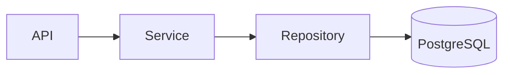

# Markdown Writing Rules

Every documentation page must start with front matter:

```yaml
---
icon: lucide/braces
tags:
  - Authoring
  - Documentation
---
```

Required front matter keys:

1. `icon` (prefer `lucide/*`)
2. `tags` (1–3 tags)

Prefer `*.md` for portability across editors and tooling.

Use these Markdown features as defaults when writing or updating docs:

1. Zudoku callouts (`:::note`, `:::tip`, `:::warning`, `:::danger`) for notes and warnings.
2. `tables` for structured data.
3. Fenced code blocks with explicit language (`bash`, `python`, `json`, `sql`).
4. Mermaid diagrams (` ```mermaid ` fenced blocks) for architecture and flows.
5. Relative links to local docs and full `https://` links for external sources.

## Usage Patterns

### Callout

```md
:::note
Содержимое заметки
:::
```

### Mermaid

For architecture, flow, or dependency pages, prefer adding a diagram:

````md

````

### Optional MDX (only when needed)

Use `*.mdx` only when you need JSX/React components that cannot be expressed in plain Markdown.
