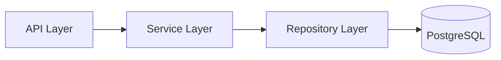

# Style Guide для документации в Zudoku

Этот гайд фиксирует единый формат написания документации для `docs-site` на `zudoku@0.68.1`.

## 0. Базовый принцип

`Markdown-first`: по умолчанию документация пишется в `*.md`, а не в `*.mdx`.

Причина:

1. `*.md` проще поддерживать в любом редакторе.
2. Меньше зависимость от JSX/React-рендера.
3. Проще автогенерация и массовые обновления.

`*.mdx` используется только как исключение, когда действительно нужен React-компонент.

## 1. Где хранить страницы

1. Пишите страницы в Markdown/MDX (`.md`, `.mdx`).
2. Основной источник страниц в проекте: `docs/`.
3. Один файл = одна тема.

Для переносимости между системами документации:

1. Новые страницы создавайте в `*.md`.
2. Не используйте MDX-импорты без необходимости.
3. Предпочитайте стандартные Markdown-конструкции.

## 2. Обязательная структура страницы

Каждая страница начинается с front matter.

```yaml
---
icon: lucide/file-text
tags:
  - Domain
  - Reference
---
```

Минимально обязательны:

1. `icon`
2. `tags` (1-3 тега)

Дополнительно при необходимости:

1. `title`
2. `description`
3. `toc`
4. `disable_pager`
5. `showLastModified`
6. `category`
7. `navigation_label`
8. `navigation_icon`

## 3. Стиль текста

1. Заголовки: короткие и предметные (`##`, `###`).
2. Сначала результат/цель, потом шаги.
3. Короткие абзацы и списки вместо длинного полотна.
4. Единая терминология по всему проекту.
5. Команды, пути и идентификаторы всегда в monospace: `make test`, `app/services`.

## 4. Блоки и примеры

1. Любой код-блок должен иметь язык.
2. Примеры должны быть минимальными, но рабочими.
3. Сразу после примера добавляйте контекст: когда использовать и какие ограничения.

```bash
curl -X GET http://localhost:8000/api/v1/health
```

```python
async def get_health() -> dict[str, str]:
    return {"status": "ok"}
```

## 5. Callouts и Markdown-расширения

Для важных замечаний используйте callouts:

```md
:::tip
Поддерживайте примеры синхронно с текущим OpenAPI-контрактом.
:::

:::caution
Не публикуйте реальные ключи, токены и пароли.
:::
```

Доступные типы: `tip`, `info`, `note`, `caution`/`warning`, `danger`.

Эти блоки работают в обычном `*.md`, поэтому это основной формат для предупреждений и подсказок.

## 6. Диаграммы Mermaid

Для архитектуры и потоков данных предпочитайте диаграммы.

```md

```

Базовый формат для проекта: fenced-блоки ` ```mermaid ` в `*.md`.

## 7. Когда разрешен MDX

MDX допустим только если нужен хотя бы один из пунктов:

1. Импорт кастомного React-компонента.
2. Интерактивный UI-компонент из `zudoku/ui/*`, который нельзя выразить Markdown.
3. Логика, требующая JSX.

Во всех остальных случаях используйте `*.md`.

## 8. Ссылки и навигация

1. Внутренние ссылки делайте относительными или корневыми.
2. Внешние ссылки только с полным `https://`.
3. После добавления новой страницы обновляйте `docs-site/zudoku.config.tsx`.
4. Не оставляйте в навигации ссылок на несуществующие файлы.

## 9. Алгоритм автоматического написания документации (md-first)

Этот алгоритм используется агентом/скриптом после изменений в коде.

1. Собрать изменения:
   `git diff --name-only <base>...HEAD`.
2. Классифицировать изменения:
   API, модель данных, архитектура, runbook, тестовые правила.
3. Сопоставить класс изменений с целевой страницей:
   `api-guidelines.md`, `data-model.md`, `architecture.md`, `runbook.md`, `testing-strategy.md`, ADR.
4. Обновить или создать страницу строго в `*.md`.
5. Сгенерировать секции страницы в едином порядке:
   Контекст -> Что изменилось -> Ограничения -> Примеры -> Связанные материалы.
6. Для важных мест вставить callouts (`:::note`, `:::warning`).
7. Добавить технические примеры (CLI/API/SQL) с указанием языка блока.
8. Проверить архитектурные решения:
   если изменился контракт/инвариант/слоистость, создать или обновить ADR.
9. Проверить навигацию:
   файл присутствует в `docs-site/zudoku.config.tsx` и ссылка валидна.
10. Прогнать проверку перед merge:
   `npm --prefix docs-site run build`.

Автоматический генератор должен применять это правило:

1. Формат по умолчанию: `*.md`.
2. Переключение на `*.mdx` только по явному флагу `requires_mdx=true`.
3. Если флаг не задан, генератор не должен вставлять JSX/импорты.

## 10. Правила качества перед merge

1. Есть front matter (`icon`, `tags`).
2. Заголовки структурированы и не пропускают уровни без причины.
3. Команды и примеры проверены на актуальность.
4. Ссылки открываются.
5. В примерах нет секретов.
6. Если меняется архитектура или API-контракт, обновлены ADR и связанные страницы.

## 11. Шаблон новой страницы (`*.md`)

```md
---
icon: lucide/file-text
tags:
  - Domain
  - Guide
---

# Название страницы

Короткий контекст: зачем эта страница и для кого.

## Что нужно сделать

1. Шаг 1
2. Шаг 2
3. Шаг 3

:::tip
Практический совет для команды.
:::

## Пример

```bash
echo "example"
```

## Связанные материалы

- [Архитектура](./architecture.md)
- [API Guidelines](./api-guidelines.md)
```

## 12. Источники правил Zudoku

Проверено по официальной документации Zudoku (через Context7):

1. Поддержка `docs.files` с `*.md` и `*.mdx`.
2. Front matter (`title`, `description`, `category`, `toc`, `disable_pager`, `navigation_*`).
3. Admonitions в Markdown (`:::note`, `:::tip`, `:::warning`, `:::danger`).
4. MDX-компоненты и кастомные импорты как расширенный, а не базовый режим.
