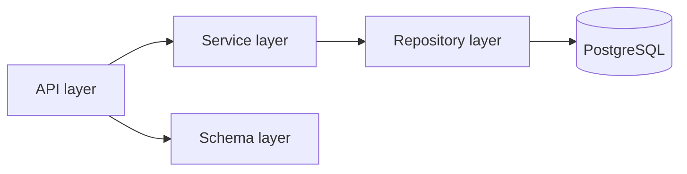

# Архитектура

## Архитектурный стиль

Проект строится как модульный монолит со строгими слоями:

1. API layer (`app/api`) принимает HTTP-запросы и возвращает DTO.
2. Service layer (`app/services`) содержит бизнес-логику.
3. Repository layer (`app/repositories`) инкапсулирует запросы к БД.
4. Model layer (`app/models`) описывает ORM-модели.
5. Schema layer (`app/schemas`) описывает контракты запросов/ответов.

## Диаграмма слоев



## Структура проекта

```text
app/
├── api/
│   ├── v1/
│   │   ├── endpoints/
│   │   └── router.py
│   └── dependencies.py
├── core/
│   ├── config.py
│   ├── security.py
│   ├── database.py
│   ├── errors.py
│   └── handlers.py
├── models/
├── schemas/
├── repositories/
├── services/
├── main.py
└── app_factory.py
```

## Правила зависимостей

- API может зависеть от Services и Schemas.
- Services могут зависеть от Repositories и domain helpers.
- Repositories могут зависеть только от ORM, query builders и DB session.
- Обратные зависимости запрещены.
- `app_factory.create_app()` обязателен для удобства тестирования.

## Dependency Injection

Используется встроенный DI FastAPI через `Depends`:

- `get_db_session` для `AsyncSession`.
- `get_current_user` для аутентификации.
- `get_*_service` для инъекции сервисов.
- `get_settings` для конфигурации.

Все провайдеры зависимостей объявляются в `app/api/dependencies.py` и `app/core/*`.

## Async Patterns

- Все route handlers объявляются через `async def`.
- Работа с БД только через `AsyncSession`.
- Middleware и внешние интеграции реализуются в async-стиле.
- Блокирующий код выносится в отдельные worker-слои (на текущем этапе фоновые задачи не требуются).

## API Boundaries

- Внешний контракт определяют только Pydantic-схемы.
- ORM-модели не возвращаются напрямую из API.
- Единая схема ошибок регистрируется централизованно в `create_app`.

## Data Model Source of Truth

Источник истины по структуре домена: документация в `docs/ru/data-model.md` и ADR.
Схема БД может эволюционировать, но любые изменения сначала фиксируются в документации, затем в миграциях.
