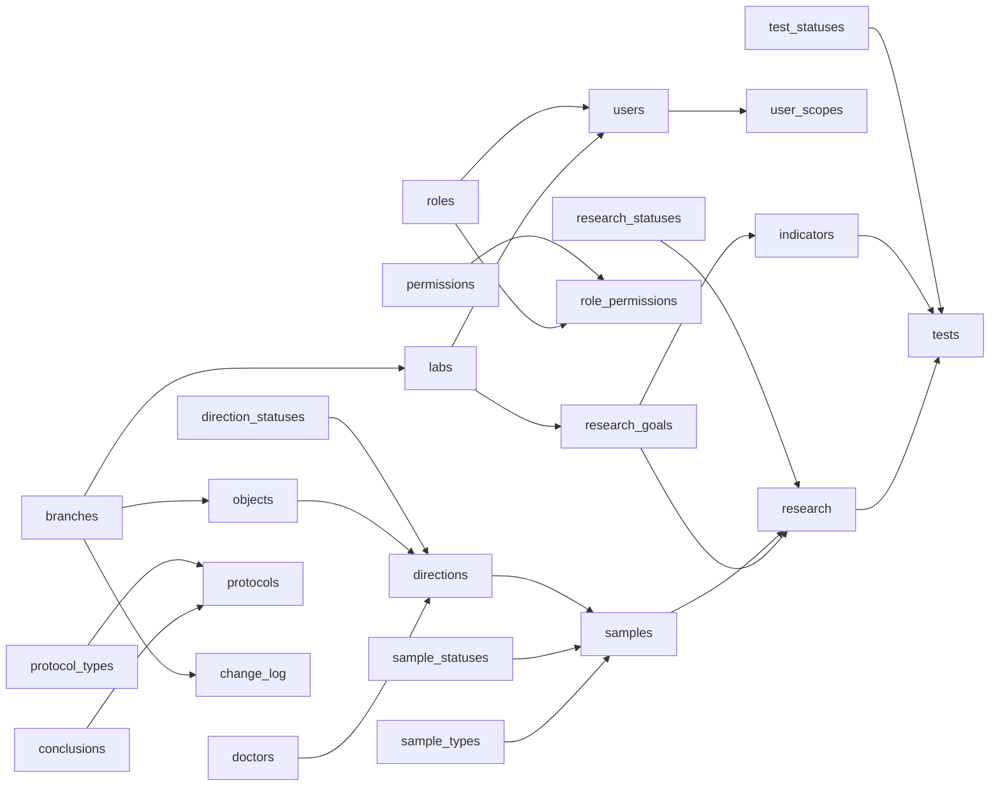

# Модель данных

Эта страница содержит общее описание модели данных и карту связей.
Подробное описание каждой таблицы вынесено в отдельные файлы.

## Базовые инварианты

1. Идентификаторы сущностей: `UUID v7`.
2. Для PK используется серверный `DEFAULT uuidv7()`.
3. Для операционных сущностей используется soft delete через `deleted_at`.
4. Временные поля — `timestamptz`.

## Карта связей

## Каталог сущностей

| Таблица | Описание |
| --- | --- |
| [`branches`](data-model/entities/branches.md) | Филиалы |
| [`change_log`](data-model/entities/change_log.md) | Журнал изменений |
| [`conclusions`](data-model/entities/conclusions.md) | Заключения |
| [`direction_statuses`](data-model/entities/direction_statuses.md) | Статусы направлений |
| [`directions`](data-model/entities/directions.md) | Направления |
| [`doctors`](data-model/entities/doctors.md) | Врачи |
| [`indicators`](data-model/entities/indicators.md) | Показатели |
| [`labs`](data-model/entities/labs.md) | Лаборатории |
| [`objects`](data-model/entities/objects.md) | Объекты |
| [`protocol_types`](data-model/entities/protocol_types.md) | Типы протоколов |
| [`protocols`](data-model/entities/protocols.md) | Протоколы |
| [`permissions`](data-model/entities/permissions.md) | Каталог разрешений |
| [`research`](data-model/entities/research.md) | Исследования |
| [`research_goals`](data-model/entities/research_goals.md) | Цели исследований |
| [`research_statuses`](data-model/entities/research_statuses.md) | Статусы исследований |
| [`role_permissions`](data-model/entities/role_permissions.md) | Права ролей |
| [`roles`](data-model/entities/roles.md) | Роли |
| [`sample_statuses`](data-model/entities/sample_statuses.md) | Статусы образцов |
| [`sample_types`](data-model/entities/sample_types.md) | Типы проб |
| [`samples`](data-model/entities/samples.md) | Пробы |
| [`test_statuses`](data-model/entities/test_statuses.md) | Статусы испытаний |
| [`tests`](data-model/entities/tests.md) | Испытания |
| [`user_scopes`](data-model/entities/user_scopes.md) | Области доступа пользователей |
| [`users`](data-model/entities/users.md) | Пользователи |
