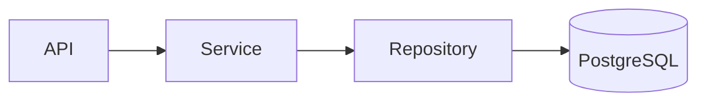

# Правила написания документации

Эта страница фиксирует базовые правила для страниц в `docs/`.
Расширенный style guide для Zudoku: [`DOCS_STYLEGUIDE.md`](./DOCS_STYLEGUIDE.md).
Алгоритм автоматического написания документации: раздел `9` в [`DOCS_STYLEGUIDE.md`](./DOCS_STYLEGUIDE.md).

## 0. Политика формата

1. По умолчанию новые страницы создаются в `*.md`.
2. `*.mdx` используется только если без JSX/React-компонентов задачу нельзя решить.
3. Для callouts и большинства типовых блоков используйте Markdown-синтаксис (`:::tip`, `:::warning`) без MDX.

## 1. Обязательный front matter

Каждая Markdown-страница должна начинаться с метаинформации:

```yaml
---
icon: lucide/braces
tags:
  - Authoring
  - Documentation
---
```

Минимальные обязательные поля:

1. `icon` — иконка страницы (предпочтительно `lucide/*`).
2. `tags` — минимум 1–2 тега, описывающих тему страницы.

Дополнительно по необходимости:

1. `title`
2. `description`
3. `status`
4. `hide`
5. `template`

## 2. Базовая структура страницы

Рекомендуемая структура:

1. Заголовок `#`
2. Короткий контекст (что и зачем)
3. Основной материал (правила, примеры, ограничения)
4. Проверочный список или next steps

## 3. Использование возможностей рендера

Используйте возможности Zudoku и MDX, а не «плоский» текст:

1. Callouts (`:::tip`, `:::note`, `:::caution`) для заметок и ограничений.
2. Таблицы для структурированных правил и сравнений.
3. Явно типизированные code blocks (с указанием языка).
4. Mermaid для архитектурных схем и потоков данных.
5. MDX-компоненты (`Tabs`, `Accordion`, `Card`) при необходимости интерактива.

Пример callout:

```md
:::caution
Любое изменение API-контракта должно быть отражено в ADR.
:::
```

Пример Mermaid:

```md

```

## 4. Требования к стилю

1. Пишите короткими абзацами и списками.
2. Используйте одно значение термина на всем проекте.
3. Код и пути оформляйте в monospace: `app/services`, `npm run build`.
4. Для спорных/долгоживущих решений добавляйте ссылку на ADR.

## 5. Обязательный чеклист перед merge

1. У страницы есть front matter с `icon` и `tags`.
2. Навигация в `docs-site/zudoku.config.tsx` ссылается на существующий файл.
3. Для новой архитектурной информации добавлена диаграмма Mermaid (если применимо).
4. Документация в `docs-site` собирается без ошибок (`npm run build`).
